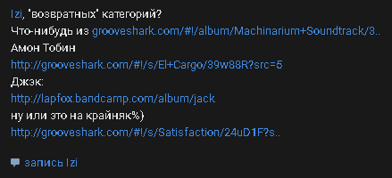

### LiteWK

Баганный Web-клиент для VK. Бэкенда нет, работает на GitHub Pages. Однако для некоторых функций придётся поднять прокси-сервер (см. примечания). На данный момент разработка не ведётся.

Клиент написан на JavaScript без использования фреймворков с использованием библиотек: 
Umbrella.js, Moment.js Twemoji.js, Lottie (для анимированных стикеров).

### Примечания

- Для использования нужен токен от VK API. Сайт сохраняет его в localStorage и не отправляет третьим лицам.    Однако, ваш токен может быть украден, например, с помощью XSS-уязвимости, либо с помощью стиллера, либо с помощью незащищённого WiFi.  Если вы почувствовали, что ваш токен украли, отключите приложение, с которого вы его получали в настройках VK.  Если во вкладке "приложения" нет того, с которого вы получали токен, в VK ID зайдите в "Безопасность и вход" и нажмите "Завершить другие сеансы". Стоит так же поменять пароль.

- Фичи, по типу получения даты регистрации или просмотр документации могут не работать из-за ограничений CORS. По умолчанию выставлен прокси-сервер от allorigins, но для некоторых функций придётся запустить прокси-сервер из папки [lwk-proxy-server](lwk-proxy-server). 

### Авторы

|Предмет|Сущность|
|-|-|
|VK API и оригинальный дизайн|VK Team|
|Весь код|Я|
|Обложка репозитория, помощь в тестировании|D. Alexandrov|
|Нашёл метод для деархивации поста|@eremeyko|
|Показ групп, которые админит пользователь|InfoApp от [Багосов](https://vk.com/bagosi)|

### Задачи

- [x] AJAX-роутинг (25.05.2024)
- [x] Сохранение страниц в массив, чтобы не приходилось загружать заново (11.06.2024)
- [x] Поддержка капчи (26.05.2024)
- [x] Кнопка "наверх", впоследствии "назад" (03.06.2024)
- [x] Кнопка "наверх" при определённых обстоятельствах будет кнопкой "Вернуться" (16.07.2024)
- [x] Проверка ссылок (19.06.2024)
- [x] #-роутинг (06.07.2024)
- [x] Сохранение контента в IndexedDB (28.07.2024)
- [x] Скелет страницы при загрузке (28.07.2024)
- [ ] Английский язык
- [ ] Расставить лоадеры
- [ ] Дать пользователю возможность отправки аналитики
- [ ] При наведении на пункт меню должны показываться подпункты (типо как в vk opt)
- [x] Кастомные галочки и радиокнопки (01.09.2024)
- [ ] Кастомные select'ы

#### Аккаунт

- [x] Возможность добавления больше одного аккаунта (27.05.2024)
- [x] Вход/выход (15.05.2024)
- [x] Просмотр ЧС (17.07.2024)
- [ ] Редактирование настроек уведомлений
- [ ] Редактирование настроек приватности
- [ ] Деактивация и реактивация аккаунта
- [ ] Список авторизованных приложений
- [ ] Информация о токене
- [ ] Авторизация по логину и паролю
- [ ] Авторизация по логину. И SMS
- [ ] Поддержка 2fa
- [x] Показ счётчиков в пунктах меню (30.06.2024)
- [x] Не использовать vkhost.github.io (30.06.2024)
- [x] Локальное редактирование аккаунтов (15.07.2024)
- [x] Поддержка отображения того, что твой акк забанили. (17.07.2024)
- [x] Поддержка анонимных токенов (02.09.2024)
- [x] Отзывание токена (06.09.2024)

#### Настройки

- [x] Собственный CSS и JS (17.05.24)
- [x] Выбор формата даты (17.05.24)
- [x] Настройка левого меню (перемещение, добавление, удаление элементов) (15.06.2024)
- [x] Выбор языка (21.05.2024)
- [x] Выбор аккаунтов (22.05.2024)
- [x] Твики интерфейса (31.05.2024)

#### Темы оформления

- [x] Темы оформления. (05.08.2024)

#### Страница пользователя

##### Информация о пользователе

Страница пользователя сделана в стиле VK 2006-2022.

- [x] **Личная информация**
- [x] Имя, Фамилия, Отчество (никнейм), Девичья фамилия (14.05.2024)
- [x] Статус (14.05.2024)
- [x] Семейное положение + человек в нём (16.05.2024)
- [x] Родной город (14.05.2024)
- [x] Владение языками (14.05.2024)
- [x] Дата регистрации. НО С УСЛОВИЕМ! (05.07.2024)
- [x] Родственники (20.05.2024)
- [x] "Страница мёртвого человека" (29.07.2024)
- [x] **Контакты**
- [x] Страна (26.05.2024)
- [x] Мобильный телефон, дополнительный телефон, Skype, личный сайт (26.05.2024)
- [x] **Интересы** (24.05.2024)
- [x] **Образование** (26.05.2024)
- [x] **Карьера** (26.05.2024)
- [x] **Военная служба** (26.05.2024)
- [x] **Жизненная позиция** (26.05.2024)
- [x] **Счётчики** (14.05.2024)
- [x] Значок у имени (20.05.2024)
- [x] Поддержка отображения блокировки страницы (ркн/полная блокировка) (17.07.2024). Заморозка не отображается в API.
- [ ] Поддержка отображения нахождения в чёрном списке у пользователя
- [x] Блоки информации (10.07.2024-13.07.2024)
- [ ] Блок аудиозаписей
- [ ] Расширение стены при скролле
- [ ] Детальная информация об онлайне с иконкой
- [x] Возможность посмотреть, какие группы создал человек (взято у багосов infoapp) (08.09.2024)
- [ ] Возможность посмотреть стикерпаки пользователя

##### Действия с профилем

- [x] Добавить в закладки (19.05.2024)
- [x] Дружба (17.05.2024)
- [x] Чёрный список (17.05.2024)
- [x] Убрать из ленты новостей (24.05.2024)
- [x] Подписаться/отписать на/от обновления/обновлений (01.06.2024)
- [x] Оставить в подписках/в принципе режим подписок (08.09.2024)
- [x] Репорт (05.08.2024)

##### Редактирование профиля

- [ ] Смена аватара
- [ ] Смена миниатюры
- [ ] Смена обложки
- [ ] Смена имени/фамилии/пола (под вопросом из-за VK ID)
- [ ] Смена статуса
- [ ] Смена семейного положения

Судя по всему, пункты ниже реализовать не получится, так как через API их просто не поменяешь (в мобильном приложении изменение этих полей происходит через webview)

- [ ] "Владею языками"
- [ ] "Родственники"
- [ ] "Контакты"
- [ ] "Интересы"
- [ ] "Образование"
- [ ] "Карьера"
- [ ] "Военная служба"
- [ ] "Жизненная позиция"

#### Страница группы

Страница группы сделана в стиле VK 2006-2022.

##### Информация о группе
- [x] Название, описание, статус, прочая информация, шапка, аватарка (29.05.2024)
- [ ] Вики-страница
- [x] История группы (21.07.2024)
- [x] Блоки информации (10.07.2024-13.07.2024)
- [ ] Блок аудиозаписей
- [ ] Блок обсуждений
- [ ] Блок документов
- [ ] Похожие группы
- [ ] **Действия**
- [x] Вступление (17.06.2024)
- [x] Добавление в закладки (17.06.2024)
- [ ] "Пригласить друзей"
- [ ] Поддержка встреч (пойду/возможно пойду)
- [ ] Поддержка закрытых групп (подать заявку/отменить заявку)
- [ ] Поддержка отображения нахождения в чёрном списке группы

Проблемные моменты:

- [ ] "Рекомендовать друзьям": раньше была такая кнопка, ныне куда-то пропала.
- [ ] Репорт. Метода для жалобы на группу тупо нету.

#### Стена

- [x] Вкладки (все посты, владельца страницы, чужие посты, архивированные) (23.05.2024)
- [x] Отдельная страница со стеной (29.05.2024)
- [x] Отдельная страница с постом (28.05.2024)
- [x] Поиск по стене (20.05.2024)
- [x] Сортировка "сначала старые" (как в Kate Mobile) (29.05.2024)
- [ ] Пагинатор

##### Пост

- [x] Шаблон поста (19.05.2024)
- [x] Сокращение поста до "показать полностью" (30.07.2024)
- [x] Мозайка из картинок и видосов (01.08.2024)
- [ ] Поддержка "карусели"
- [ ] Отправка события "просмотр поста" на усмотрение пользователя (stats.trackEvent)
- [ ] **Действия с постом**
- [x] Лайк (19.05.2024)
- [x] ^ Остальные реакции
- [ ] Репост (отдельная тема)
- [x] Удаление/восстановление (19.05.2024)
- [x] Архивирование/разархивирование (24.05.2024)
- [x] Добавление/удаление в закладки (19.05.2024)
- [x] Прикрепление/открепление (19.05.2024)
- [x] Отключение/включение комментариев (19.05.2024)
- [ ] Редактирование (отдельная тема)
- [x] Репорт (05.08.2024)
- [x] **Дополнительные поля постов**
- [x] Подпись автора (29.05.2024)
- [x] Число просмотров (20.05.2024)
- [x] "Рекламный пост" (31.05.2024)
- [x] Источник поста (29.05.2024)
- [x] Удалил страницу (16.05.2024)
- [x] Обновил фотографию (29.05.2024)
- [x] Написал на сайте (16.06.2024)
- [x] Геолокация (23.06.2024)
- [ ] Поддержка отображения комментария на странице поста (tldr)
- [ ] Показ комментариев на стене (то есть без перехода на страницу с постом)
- [ ] Локальные хэштеги
- [ ] Модальное окно с постом
- [ ] Пост "Только для друзей"
- [x] Тет-а-тет посты (удалённая древняя функция вк, пример ниже) (04.08.2024)

- [ ] Постер (фейсбукоподобныйкартинкоузоровыйтекстобольшой тип постов). Добавлен в 2018 и удалён где-то между 2021-2023, скорее всего из-за низкой популярности.

#### Вложения

- [x] Фотография (17.05.2024)
- [x] Видео (17.05.2024)
- [ ] Аудио
- [x] Документ (17.05.2024)
- [x] Если документ гифовый, то отображать кнопку плюсик.
- [x] Опрос (06.08.2024)
- [ ] Заметка
- [ ] Статья
- [x] Стикер (21.07.2024)
- [ ] ВК-Клип
- [ ] Товар
- [x] Граффити (старые) (23.06.2024)
- [ ] Вики-страница
- [ ] Миниапп
- [x] Ссылка (24.06.2024)
- [x] Фотоальбом (04.08.2024)

#### Опрос

- [x] Шаблон опроса (06.08.2024)
- [x] Выбор вариантов ответа (06.08.2024)
- [x] Отмена голоса (06.08.2024)
- [ ] Просмотр голосовавших 

#### Создание поста/коммента

##### Пост

- [ ] Subject
- [ ] Выбор эмодзи
- [ ] Пикер фото
- [ ] Пикер видео
- [ ] Пикер аудио
- [ ] Пикер документов
- [ ] Пикер замет.
- [ ] Прикрепление ссылки
- [ ] Прикрепление геолокации
- [ ] Создание опроса
- [ ] Доп. настройки (выкл комментарии, не отправлять уведомления, источник, реклама)
- [ ] Видно кому?
- [ ] Отложка

##### Коммент

- [ ] Выбор стикера
- [ ] Поддержка веток

##### Комментарии

- [x] Шаблон комментария (02.06.2024)
- [x] Выбор сортировки комментариев (20.06.2024)
- [ ] **Действия**
- [x] Лайк (03.06.2024)
- [ ] Репост
- [ ] Удаление
- [ ] Редактирование
- [ ] Репорт
- [x] Ветка комментариев (03.06.2024)
- [x] Показывать метку, если автор комментария является автором поста (02.06.2024)

#### Новости

- [ ] Новости
- [ ] "Умная лента"
- [ ] Вкладки новостей (photo, photo_tag, friend, note, video, audio, all) (22.06.2024)
- [ ] `return_banned`
- [ ] Рекомендации
- [ ] "Не показывать в ленте"
- [ ] Блокировка источников в новостях
- [ ] Списки новостей

#### Списки новостей

- [ ] Редактирование
- [ ] Создание

#### Друзья

- [ ] Все друзья
- [ ] Друзья онлайн
- [ ] Поиск по друзьям
- [ ] Мало взаимодействуете?
- [ ] Общие с человеком друзья
- [ ] Очистка заявок
- [ ] Смена сортировки
- [ ] **Списки друзей**
- [ ] Просмотр
- [ ] Создание
- [ ] Редактирование
- [ ] **Заявки в друзья**
- [ ] Исходящие
- [ ] Входящие

#### Список групп

- [ ] Все группы
- [ ] Управляемые
- [ ] Встречи
- [ ] Вкладки встреч (сегодня, на этой неделе, все)
- [ ] Календарь встреч
- [ ] Рекомендуемые 
- [ ] Поиск среди групп
- [ ] Недавние группы
- [ ] Очистка недавних групп
- [ ] Счётчик новых постов у подписок

#### Список лайкнувших

- [ ] Список лайкнувших
- [ ] Всплывашка

#### Фотографии/альбомы

- [ ] **Фотографии**
- [ ] Все фотографии
- [ ] Разделение по годам
- [ ] Загрузка фотографий
- [ ] Действия (лайк, репост, удаление)
- [ ] Комментарии
- [ ] Отметка людей на фото
- [ ] "Сделать фотографией профиля"
- [ ] "Указать место"
- [ ] "Скачать"
- [ ] Редактирование описания
- [ ] "Добавить в сохранёнки"
- [ ] "Архивировать фото"
- [ ] "Перейти к альбому"
- [ ] **Альбомы**
- [ ] Все альбомы
- [ ] Создание альбомов
- [ ] Редактирование альбомов
- [ ] Скачивание всех фоток
- [ ] Смена сортировки
- [ ] "Комментарии к альбому"
- [ ] "Выбрать несколько"
- [ ] Перемещение фото по альбому

#### Видео

- [ ] Рекомендации
- [ ] Подтемы рекомендаций
- [ ] Тренды
- [ ] Трансляции
- [ ] **Мои видео**
- [ ] Добавленные
- [ ] Плейлисты
- [ ] Обзор комментариев
- [ ] Загруженные
- [ ] Трансляции
- [ ] "Мне понравилось"
- [ ] История просмотра
- [ ] **Плейлисты**
- [ ] Создание
- [ ] Редактирование
- [ ] добавление видео
- [ ] Перемещение видео по плейлисту
- [ ] **Видео**
- [ ] Действия
- [ ] Поделится
- [ ] "Добавить к себе"
- [ ] "Добавить в сообщество"
- [ ] "Смотреть позже"
- [ ] Вынесение плеера в окно
- [ ] Комменты

#### Закладки (bookmarks)

- [ ] Добавление в закладки
- [ ] Все закладки
- [ ] Люди
- [ ] Люди онлайн
- [ ] Сообщества
- [ ] Записи
- [ ] Статьи
- [ ] Ссылки
- [ ] подкасты
- [ ] Видео
- [ ] сюжеты
- [ ] игры
- [ ] сервисы
- [ ] Поиск по ним
- [ ] Недавние закладки
- [ ] Добавление ссылок в закладки
- [ ] Список тегов под закладкой (стилизация)
- [ ] Просмотр лайкнутых объектов (как в приложении на андроид)
- [ ] **Метки**
- [ ] Просмотр
- [ ] Создание
- [ ] Редактирование

#### Уведомления

- [ ] Список уведомлений
- [ ] Иконки уведомлений
- [ ] Раскрывающиеся уведомления 
- [ ] Кнопки действий
- [ ] Кнопки действий с контекстом
- [ ] Дополнительные кнопки действий
- [ ] Под-иконки
- [ ] Скрытие уведомлений иВосстановление
- [ ] "Пометить уведомления как прочитанные" автоматически (24.07.2024) 
- [ ] Attachments
- [ ] Если уведомление связано с созданием поста на стене, то показывать кнопку лайка.

Пункты ниже, вероятно, не получится реализовать, так как данных фич нет даже в мобильном клиенте, и в api тоже не нашёл. (`filters` больше не работает)

- [ ] От друзей
- [ ] Ответы
- [ ] Уведомления группы

#### Поиск

- [ ] По три результата из каждого раздела (execute)
- [ ] Люди (users.search)
- [ ] Группы (groups.search)
- [ ] Посты (newsfeed.search)
- [ ] Аудио (audio.search)
- [ ] Видео (video.search)
- [ ] Фотографии (photos.search, в веб версии вк такого нету)
- [ ] Файлы (docs.search)
- [ ] игры
- [ ] **Параметры поиска**
- [ ] **Пользователи**
- [ ] Город
- [ ] Пикер города
- [ ] Возраст
- [ ] Дата рождения
- [ ] Пол
- [ ] Образование (универы, школы, уровни, город, учебное заведение, год выпуска, и пр. х.)
- [ ] Карьера
- [ ] Семейное положение
- [ ] "С фотографией", "на сайте"
- [ ] Участники группы
- [ ] Друзья пользователя
- [ ] **Группы**
- [ ] Сортировка
- [ ] По типу группы (паблик, клуб, мероприятие)
- [ ] Город
- [ ] Пикер города
- [ ] Категория группы (в вк выбрать категорию в поиске можно только со страницы групп на которые ты подписан. в большом поиске (vk.com/search/communities) этого сделать нельзя. и в api кстати тоже. хотя эта настройка сама по себе напрашивается. ну вк хули.)
- [ ] **Посты**
- [ ] Наличие прикреплений
- [ ] Тип (обычные, только копии)
- [ ] "Содержит ссылку"
- [ ] "Содержит ссылку" -> вместо оператора "url:" оператор "domain:"
- [ ] "Исключить слова"
- [ ] "Отметки нравится"
- [ ] "Скрывать похожие записи"
- [ ] Геолокация
- [ ] Подсветка найденного

#### Обсуждения в группах

- [ ] Список
- [ ] Страница обсуждения
- [ ] Смена сортировки
- [ ] Создание обсуждения

#### Документы

- [ ] Список документов
- [ ] Поиск
- [ ] Метки
- [ ] Загрузка
- [ ] Редактирование
- [ ] Типы
- [ ] Удаление
- [ ] Восстановление
- [ ] Добавление к "себе"
- [ ] Иконки для разных типов документов
- [ ] Отдельная страница документа

#### Заметки

- [ ] Список заметок
- [ ] Действия
- [ ] Создание
- [ ] Редактирование

#### Список подписок

- [ ] Список подписок

#### Подарки

- [ ] Список подарков
- [ ] Отправление подарков
- [ ] Удаление своих подарков

#### Обсуждения в группах

- [ ] Список обсуждений
- [ ] Просмотр обсуждений
- [ ] Смена сортировки
- [ ] Создание обсуждений

#### Статьи

- [ ] Список статей
- [ ] Просмотр статьи
- [ ] Создание статьи

#### Игры и приложения

...

#### ~~Баг-трекер~~

...

#### Сообщения

отдельная история

#### Аудиозаписи

отдельная история

#### Документация

Да-да, не удивляйтесь.

- [x] Просмотр статей, форматирование markdown (27.08.2024)
- [x] Поддержка изображений (28.08.2024)
- [x] Показ параметров, ошибок (29.08.2024)
- [x] Меню, сворачивание в подпункты (29.08.2024)
- [x] Запуск методов API (30.08.2024)
- [x] Поиск по документации (31.08.2024)
- [x] Состояние API (01.09.2024)
